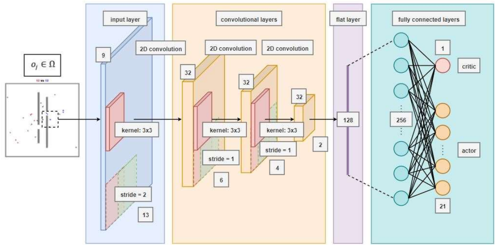

<!-- STYLE -->
<div style="text-align: justify">

<!-- TOP LINK -->
<a name="readme-top"></a>

##

<!-- SOCIAL MEDIA LINKS -->
<a href="https://github.com/M-Espinos-Longa">
  
</a>
&nbsp
<a href="https://www.linkedin.com/in/marc-espinos-longa/">
  
</a>
&nbsp
<a href="https://twitter.com/EspinosMarc">
  
&nbsp
<a href="https://marcespinoslonga.wordpress.com/">
  
</a>
&nbsp
<a href="https://orcid.org/0000-0001-7916-9383">
  
</a>

<!-- COVER -->
<p align="center">
  <div align="center">
    <a href="https://www.researchsquare.com/article/rs-2065000/v1">
      
    </a>
    <h1 align="center"><strong> Decentralized Multi-Agent Deep Reinforcement Learning: A Competitive-Game Perspective</strong></h1>
    <p>
      Authors: Marc Espinós Longa, Antonios Tsourdos, Gokhan Inalhan <br/>
      Last Updated: 20 Nov 2023
    </p>
  </div>
</p>


<!-- TABLE OF CONTENTS -->
<details>
  <summary><strong> Table of Contents </strong></summary>
  <ol>
    <li><a href="#abstract"> Abstract </a></li>
    <li><a href="#structure"> Structure </a></li>
    <li><a href="#requirements"> Requirements </a></li>
    <li><a href="#acknowledgements">Acknowledgements</a></li>
    <li><a href="#contributions">Contributions</a></li>
    <li><a href="#citation">Citation</a></li>
  </ol>
</details>


<!-- ABSTRACT -->
<a name="abstract"></a>

## Abstract
Deep reinforcement learning (DRL) has been widely studied in single agent learning but require further development and understanding in the multi-agent field.  As one of the most complex swarming settings, competitive learning evaluates the performance of multiple teams of agents cooperating to achieve certain goals while surpassing the rest of group candidates.  Such dynamical complexity makes the multi-agent problem hard to solve even for niche DRL methods. Within a competitive framework, we study state-of-the-art actor-critic and Q algorithms and analyze in depth their variants (e.g., prioritization, dual networks, etc.) in terms of performance and convergence. For completeness of discussion, we present and assess an asynchronous and prioritized version of proximal policy optimization actor-critic technique (P3O) against the other benchmarks.  Results prove that Q-based approaches are more robust and reliable than actor-critic configurations for the given setting. In addition, we suggest incorporating local team communication and combining DRL with direct search optimization to improve learning, especially in challenging scenarios with partial observability.


<!-- STRUCTURE -->
<a name="structure"></a>

## Structure
Our code repository contains the following code files:

* Environment manager: `Experiments`.
* Markov Decision Process framework: `MDPWrapper`.
* Multi-Agent DRL systems: `A3CAgents`, `DQNAgents` (DQN model included), `DuelingDDQNAgents`, `P3OAgents`, `PPOAgents`, `RandomAgents`.
* Network models: `A3CModel`, `DuelingDDQNModel`, `P3OModel`, `PPOModel`.
* Training data structures: `Dataclasses`.
* Graphs and plots: `graphicGenerator`.
* Executable file: `run`.

All the experimental data (including metrics from independent runs and trained model weights) used in our analysis are stored in their respective system folders. 


<!-- REQUIREMENTS -->
<a name="requirements"></a>

## Requirements
This project is built in Python 3.10.12 and Linux operating system. 

_Library list_:
* Multi-agent environemnt: `PettingZoo` 
* Nets: `PyTorch`
* MLOps: `wandb`
* Sim tools: `tqdm`
* Others: `numpy`, `matplotlib`


<!-- ACKNOWLEDGMENTS -->
<a name="acknowledgements"></a>

## Acknowledgements
This work is funded by the Engineering and Physical Sciences Research Council (EPSRC) and BAE Systems under the project reference number 2454254.


<!-- CONTRIBUTIONS -->
<a name="contributions"></a>

## Contributions
Study conceptualization, methodology, analysis, visualization, discussion, and writing by M.E.L.; conceptualization, review, supervision, and funding acquisition by A.T. and G.I.


<!-- CITATION -->
<a name="citation"></a>

## Citation
Espinós Longa, M., Tsourdos, A., & Inalhan, G. (2023). Decentralized Multi-Agent Deep Reinforcement Learning: A Competitive-Game Perspective. Nature Scientific Reports (Peer Review). https://doi.org/10.21203/rs.3.rs-2065000/v1

```
@article{,
   author = {Marc Espinós Longa and Antonios Tsourdos and Gokhan Inalhan},
   doi = {10.21203/rs.3.rs-2065000/v1},
   journal = {Nature Scientific Reports (peer review)},
   title = {Decentralized Multi-Agent Deep Reinforcement Learning: A Competitive-Game Perspective},
   url = {https://doi.org/10.21203/rs.3.rs-2065000/v1},
   year = {2023},
}
```

<p align="right">(<a href="#">back to top</a>)</p>

</div>
